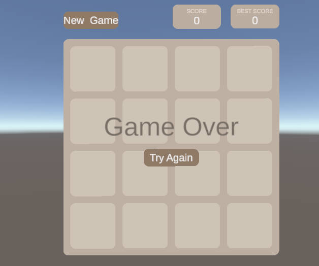
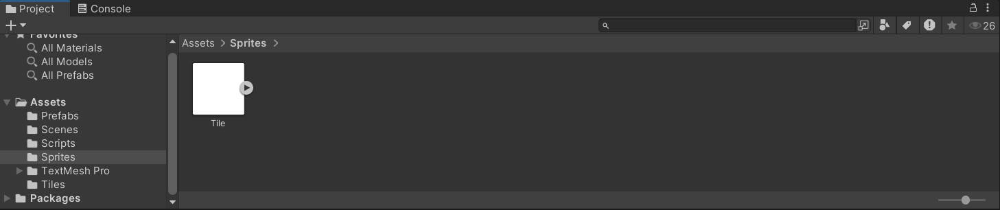
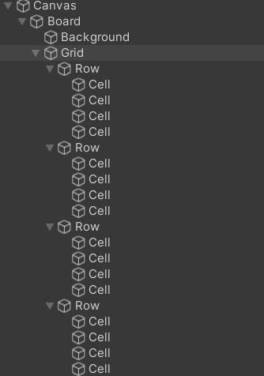
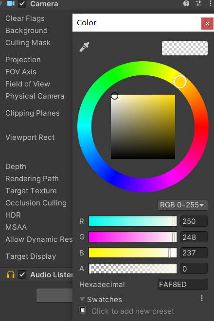

# unity_2048

## 目录
- [1. 游戏策划与设计](#游戏策划与设计)
  - [1.1 游戏概述](#游戏概述)
  - [1.2 游戏规则与流程](#游戏规则与流程)
    - [1.2.1 游戏启动](#游戏启动)
    - [1.2.2 玩家操作](#玩家操作)
    - [1.2.3 分数计算](#分数计算)
    - [1.2.4 持续移动与合并](#持续移动与合并)
    - [1.2.5 目标达成](#目标达成)
    - [1.2.6 游戏结束条件](#游戏结束条件)
    - [1.2.7 重新开始](#重新开始)
- [2. 游戏编程工具](#游戏编程工具)
- [3. 游戏实现步骤](#游戏实现步骤)
  - [3.1 游戏UI设计 ](#游戏UI设计)
  - [3.2 游戏主要逻辑实现](#游戏主要逻辑实现)
- [4. 游戏demo展示链接](#游戏demo展示链接)
- [5. 游戏下载](#游戏下载)

## 1.游戏策划与设计
<a name="游戏策划与设计"></a>

### 1.1游戏概述
<a name="游戏概述"></a>
《unity_2048》是一款经典的数字益智游戏，设计目标是通过简单的滑动操作将相同数字的方块合并，最终合成“2048”甚至是更大的方块! 游戏的核心设计元素包括网格布局、滑动合并的机制、渐进的难度和高分挑战。


### 1.2 游戏规则与流程
<a name="游戏规则与流程"></a>

#### 1.2.1 游戏启动
<a name="游戏启动"></a>
- 玩家启动游戏时，系统会生成一个 **4x4 的网格**，初始网格上会随机出现两个数字方块。生成的数字通常是 **2** 或 **4**。
- 网格其他位置为空，等待玩家进行操作。

#### 1.2.2 玩家操作
<a name="玩家操作"></a>
玩家通过键盘操作（上下左右箭头或 W、A、S、D 键）来移动网格中的数字方块。

1. **合并规则**：
    - 相同数字的方块在移动时，如果相遇就会合并，合并后的方块数字为两个原数字的 **和**（例如，两个“2”合并成“4”）。
    - 每次滑动后，只有相邻的相同数字才能合并，且每次移动只能合并一次。

2. **生成新方块**：每次有效的滑动操作后，系统会在空的网格位置随机生成一个新的数字方块，数字为 **2** 或 **4**。

#### 1.2.3 分数计算
<a name="分数计算"></a>
- 当两个方块合并时，合并后的数字会加入玩家的总分。例如，两个“4”合并为一个“8”时，玩家的分数会增加 **8** 分。
- 玩家可以通过更多的合并累积更高的分数。

#### 1.2.4 持续移动与合并
<a name="持续移动与合并"></a>
玩家不断进行操作，尝试合并更大的数字方块。整个过程中需要考虑：

#####  策略性合并
<a name="策略性合并"></a>
为了避免网格快速被填满，玩家需要选择最佳的滑动方向，尽可能创造更多合并的机会，形成更大的数字方块。

#####  方块布局管理
<a name="方块布局管理"></a>
如果网格被数字填满且没有可合并的相邻方块，游戏将结束。因此，玩家要通过移动空出更多的位置。

#### 1.2.5 目标达成
<a name="目标达成"></a>
目标就是不断冲击更高的得分

#### 1.2.6 游戏结束条件
<a name="游戏结束条件"></a>
- **失败条件**：如果网格中的所有位置都被填满，并且没有可合并的相邻方块，游戏将结束。这时，系统会弹出 **Game Over** 提示。

#### 1.2.7 重新开始
<a name="重新开始"></a>
- 游戏结束后，玩家可以选择重新开始。系统会清空网格，重新生成两个初始方块，开始新的游戏回合。

## 2.游戏编程工具
<a name="游戏编程工具"></a>
使用unity引擎进行游戏编程与设计

## 3.游戏实现步骤
<a name="游戏实现步骤"></a>

### 3.1 游戏UI设计
<a name="游戏UI设计"></a>
  #### 3.1.1 游戏整体界面展示
  <a name="游戏整体界面展示"></a>
  <div>
    
</div><br></br>
  如上图就是游戏的最终整体界面展示!

  #### 3.1.2 具体实现
  <a name="具体实现"></a>
  先为游戏导入一个500x500的白色的任意的.jpg图片作为底色! 这个图片作为Assets的sprites!
  <div>
    
</div><br></br>

  在创建一个canvas作为画布来在上面进行进一步的操作
  接下来按照以下的层次结构来创建：
  <div>
    
</div><br></br>

  接下来为每一个来添加image使用的就是我们的sprites中的Tile接下来为不同的添加不同的颜色!
  <div>
    
</div><br></br>

  最后就可以得到最终的UI界面!
### 3.2 游戏主要逻辑实现
<a name="游戏主要逻辑实现"></a>
  #### 3.2.1 移动方块的实现
code :
```csharp
private void Update()
{
    if (!waiting)
    {
        if (Input.GetKeyDown(KeyCode.W) || Input.GetKeyDown(KeyCode.UpArrow))
        {
            MoveTiles(Vector2Int.up, 0, 1, 1, 1);
        }
        else if (Input.GetKeyDown(KeyCode.S) || Input.GetKeyDown(KeyCode.DownArrow))
        {
            MoveTiles(Vector2Int.down, 0, 1, grid.height - 2, -1);
        }
        else if (Input.GetKeyDown(KeyCode.A) || Input.GetKeyDown(KeyCode.LeftArrow))
        {
            MoveTiles(Vector2Int.left, 1, 1, 0, 1);
        }
        else if (Input.GetKeyDown(KeyCode.D) || Input.GetKeyDown(KeyCode.RightArrow))
        {
            MoveTiles(Vector2Int.right, grid.width - 2, -1, 0, 1);
        }
    }
}

    private void MoveTiles(Vector2Int direction ,int startX , int incrementX ,int startY , int incrementY)
    {
        // to make sure the change is finished
        bool changed = false;
        for (int x = startX;x >= 0  && x < grid.width; x += incrementX)
        {
            for(int y = startY; y >= 0 && y< grid.height; y += incrementY)
            {
                TileCell cell = grid.GetCell(x,y);

                if (cell.occpuied)
                {
                    changed |= MoveTile(cell.tile, direction);
                }
            }
        }
        // if it already have been changed strat the coroutine
        if (changed)
        {
            StartCoroutine(WaitForChanges());
        }
    }

    private bool MoveTile(Tile tile , Vector2Int direction)
    {
        TileCell newCell = null;
        TileCell adjacent = grid.GetAdjacentCell(tile.cell,direction);

        while (adjacent != null) 
        {
            if (adjacent.occpuied)
            {
                // merge !
                if (CanMerge(tile, adjacent.tile))
                {
                    Merge(tile, adjacent.tile);
                    return true;
                }
                break;
            }

            newCell = adjacent;
            // when we move 
            // adjacent one should be updated
            adjacent = grid.GetAdjacentCell(adjacent, direction);
        }

        if (newCell != null)
        {
            tile.MoveTo(newCell);
            return true;
        }

        return false;
    }

```

这段代码是实现 2048 游戏的关键部分，主要包含玩家输入处理、方块移动和合并的逻辑。以下是对代码的详细解释：

##### 1. `Update` 方法
这是 Unity 中的一个重要方法，每帧都会被调用。这个方法用于监听玩家的输入，并根据输入来移动方块。

- `if (!waiting)`: 这个条件判断用于确保在游戏等待状态（例如动画或合并效果进行中）时，不响应玩家的输入。

- `Input.GetKeyDown`: 检查玩家是否按下了特定的键。如果按下的是 **W** 或 **上方向键**，则调用 `MoveTiles` 方法，传递向上的移动方向及其他参数。

- 对于其他方向（下、左、右），相应的按键也会触发相应的 `MoveTiles` 方法，传递不同的参数来处理不同的移动方向。

##### 2. `MoveTiles` 方法
这个方法用于处理方块的移动逻辑。

- **参数说明**:
  - `direction`: 表示移动的方向（如上、下、左、右）。
  - `startX`, `incrementX`: 控制在水平方向上的遍历方式。`startX` 是起始列索引，`incrementX` 控制遍历方向（正向或反向）。
  - `startY`, `incrementY`: 控制在垂直方向上的遍历方式，含义与 `startX` 和 `incrementX` 类似。

- **逻辑流程**:
  1. `bool changed = false;`: 声明一个布尔变量，用于标记是否有方块发生了移动或合并。
  2. 使用嵌套循环遍历网格中的每个方块。外层循环遍历水平方向，内层循环遍历垂直方向。
  3. `TileCell cell = grid.GetCell(x,y);`: 获取当前遍历的方块（网格单元）。
  4. `if (cell.occpuied)`: 判断该单元是否被占用。如果是，则调用 `MoveTile` 方法尝试移动该方块。
  5. `changed |= MoveTile(cell.tile, direction);`: 如果方块成功移动或合并，`changed` 将被设置为 `true`。

- **结束逻辑**:
  - 如果有方块发生变化（移动或合并），则调用 `StartCoroutine(WaitForChanges())`，以处理后续的变化（如生成新方块、更新分数等）。

##### 3. `MoveTile` 方法
这个方法用于实现单个方块的移动和合并逻辑。

- **参数说明**:
  - `Tile tile`: 当前需要移动的方块。
  - `Vector2Int direction`: 移动的方向。

- **逻辑流程**:
  1. `TileCell newCell = null;`: 用于存储方块将要移动到的新单元。
  2. `TileCell adjacent = grid.GetAdjacentCell(tile.cell, direction);`: 获取当前方块在移动方向上的相邻单元。

  3. **移动逻辑**: 使用 `while` 循环来检查方块在移动方向上的每个相邻单元。
     - 如果相邻单元被占用（`adjacent.occpuied`），则检查是否可以合并方块（通过调用 `CanMerge(tile, adjacent.tile)`）。
     - 如果可以合并，调用 `Merge(tile, adjacent.tile)` 方法合并这两个方块，并返回 `true`。
     - 如果相邻单元为空，继续向下一个相邻单元查找。

  4. **更新新位置**: 如果找到了一个空的相邻单元（`newCell != null`），则调用 `tile.MoveTo(newCell)` 将方块移动到新位置，并返回 `true`。

- **返回值**: 如果方块成功移动或合并，则返回 `true`，否则返回 `false`。

### 总结
这段代码实现了 2048 游戏中方块的移动和合并逻辑，通过 `Update` 方法处理玩家输入，通过 `MoveTiles` 和 `MoveTile` 方法实现方块在网格中的移动和合并。整体结构清晰，逻辑分明，使得方块的行为可以被准确地控制和更新。


  #### 3.2.2 合并方块的实现
code :
```csharp
      private bool CanMerge(Tile a ,Tile b)
    {
        return a.number == b.number && !b.locked;
    }

    private void Merge(Tile a ,Tile b)
    {
        tiles.Remove(a);

        // let a merge to the cell which has b
        a.Merge(b.cell);

        // limited in the array'length
        int index = Mathf.Clamp(IndexOf(b.state)+1,0,tileStates.Length-1);

        Debug.Log($"Before SetState: Current State: {b.state}, Number: {b.number}, Calculated Index: {index}");


        int number = b.number * 2;

        TileState newState = tileStates[index];
        //Debug.Log($"TileState index: {index}, Background Color: {tileStates[index].backgroundColor}, Text Color: {tileStates[index].textColor}");

        b.SetState(newState,number);

        gameManager.IncreaseScore(number);
        
    }

```

以下是对 `CanMerge` 和 `Merge` 方法的总结：

##### 1. `CanMerge` 方法
此方法用于判断两个方块是否可以合并。

- **参数**:
  - `Tile a`: 第一个方块。
  - `Tile b`: 第二个方块。

- **逻辑**:
  - 返回 `true` 如果两个方块的数字相等且方块 `b` 没有被锁定（`!b.locked`）。否则返回 `false`。

##### 2. `Merge` 方法
此方法用于合并两个方块。

- **参数**:
  - `Tile a`: 要合并的第一个方块。
  - `Tile b`: 要合并的第二个方块。

- **逻辑流程**:
  1. `tiles.Remove(a);`: 从方块列表中移除方块 `a`。
  2. `a.Merge(b.cell);`: 将方块 `a` 合并到方块 `b` 的单元格中。
  3. 计算合并后的方块的状态索引，使用 `Mathf.Clamp` 限制索引在有效范围内。
  4. 计算合并后的新数字：`int number = b.number * 2;`。
  5. 根据计算得到的索引获取新状态：`TileState newState = tileStates[index];`。
  6. 设置方块 `b` 的新状态和数字：`b.SetState(newState, number);`。
  7. 更新游戏分数，调用 `gameManager.IncreaseScore(number);`。

##### 总结
- `CanMerge` 方法用于判断两个方块能否合并，`Merge` 方法执行实际的合并逻辑，更新方块的状态和游戏分数。

## 4.游戏demo展示链接
<a name="游戏demo展示链接"></a>
https://www.bilibili.com/video/BV1Tt22YPE6j/

## 5.游戏下载
<a name="游戏下载"></a>
在本仓库中直接下载2048_1.1.zip文件，解压缩即可游玩!

